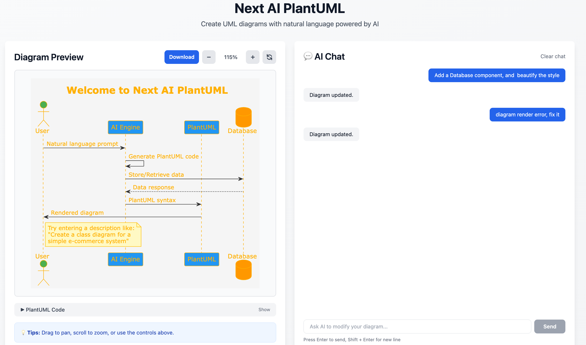

# Next AI PlantUML
[](LICENSE) · Copyright © 2025-present warm3snow

Language: English | [中文](README.zh.md)

A Next.js-based UML Diagram Generator that leverages AI to create PlantUML diagrams from natural language descriptions. Create, modify, and enhance diagrams through AI-powered interactions with an interactive live preview.

## Features

- 🤖 **Multi-Provider AI Support**: Use Ollama (local), OpenAI, Anthropic, Google AI, AWS Bedrock, Azure OpenAI, OpenRouter, DeepSeek, or SiliconFlow
- 📝 **Interactive Editor**: Edit PlantUML code directly with real-time preview
- 🔍 **Zoom & Pan**: Navigate large diagrams with intuitive controls
- 🎨 **Live Preview**: See your diagrams rendered instantly as you type
- 🌓 **Dark Mode**: Automatic dark mode support
- ⚡ **Fast**: Built with Next.js 15 and React 19



> Place the provided screenshot at docs/next-ai-plantuml-demo.png if it does not render above.

> If you find this project helpful, please consider giving it a ⭐ star — your support motivates continuous updates!

## Getting Started

### Prerequisites

- Node.js 18.0 or later
- One of the supported AI providers (Ollama runs locally by default)

### Installation

1. Clone the repository:
```bash
git clone https://github.com/warm3snow/next-ai-plantuml.git
cd next-ai-plantuml
```

2. Install dependencies:
```bash
npm install
```

3. Set up environment variables:
```bash
cp .env.example .env
```

Edit `.env` and configure your AI provider (see Provider Setup below).

4. Run the development server:
```bash
npm run dev
```

5. Open [http://localhost:3000](http://localhost:3000) in your browser.

## Provider Setup (concise)

Supported providers: Ollama (default), OpenAI, Anthropic, Google AI, AWS Bedrock, Azure OpenAI, OpenRouter, DeepSeek, SiliconFlow.

Configure `.env` (new format):

```env
# example: Ollama local default
PROVIDER=ollama
MODEL=llama3.2
BASE_URL=http://localhost:11434

# switch to another provider by changing PROVIDER/API_KEY
# PROVIDER=openai
# API_KEY=your_api_key_here
```

## Usage

1. **Natural Language Input**: Describe the diagram you want to create in plain English
   - Example: "Create a sequence diagram showing how a user logs into a web application"
   - Example: "Design a class diagram for a simple e-commerce system with products and orders"

2. **AI Generation**: Click "Send" or press Enter

3. **View & Navigate**: Use zoom, pan, and reset controls to explore your diagram

4. **Download**: Click "Download" to save the diagram as an image file

## Supported Diagram Types

- Sequence Diagrams
- Class Diagrams
- Use Case Diagrams
- Activity Diagrams
- Component Diagrams
- State Diagrams
- Object Diagrams
- Deployment Diagrams
- Timing Diagrams

## Technologies

- [Next.js 15](https://nextjs.org/)
- [React 19](https://react.dev/)
- [TypeScript](https://www.typescriptlang.org/)
- [Tailwind CSS](https://tailwindcss.com/)
- [Vercel AI SDK](https://sdk.vercel.ai/)
- [PlantUML](https://plantuml.com/)

## License

MIT License · Copyright (c) warm3snow

## Star History


